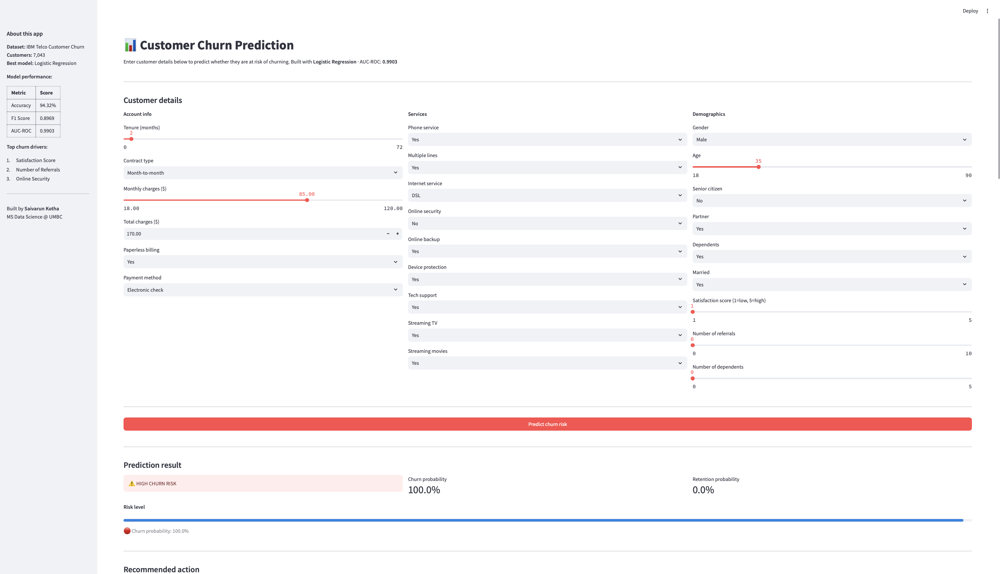
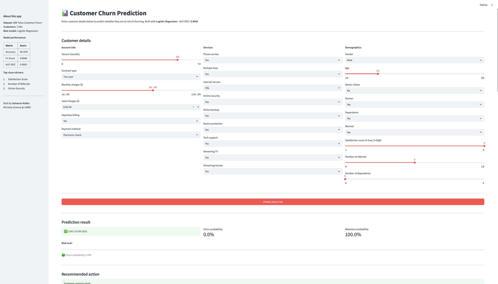

# Customer Churn Prediction

> An end-to-end machine learning project that predicts whether a telecom customer will churn, built with Python, scikit learn, XGBoost, SHAP, and deployed as an interactive Streamlit web app.

**Author:** Saivarun Kotha — MS Data Science @ UMBC  
[](https://www.linkedin.com/in/kothasaivarun/)
[](https://github.com/saivarunkotha)

---

## Problem statement

Customer churn is one of the most costly problems in the telecom industry acquiring a new customer costs 5–10x more than retaining an existing one. This project builds an automated churn prediction system that:

- Identifies customers at high risk of leaving before they churn
- Explains *why* a customer is at risk using SHAP explainability
- Provides actionable retention recommendations through an interactive web app

---

## Dataset

| Property | Detail |
|---|---|
| Source | IBM Telco Customer Churn (Kaggle) |
| Files | 6 Excel files merged into one dataset |
| Size | 7,043 customers · 44 features after merging |
| Target | `Churn Label` Yes / No |
| Churn rate | 26.5% churned · 73.5% retained |

**Data sources merged:**
- `Telco_customer_churn.xlsx` : main customer and service data
- `Telco_customer_churn_demographics.xlsx`: age, marital status
- `Telco_customer_churn_services.xlsx`: service usage and revenue
- `Telco_customer_churn_status.xlsx`: satisfaction scores, churn reasons
- `Telco_customer_churn_location.xlsx`: geographic data
- `Telco_customer_churn_population.xlsx` : zip code population data

---

## Approach & methodology

### 1. Exploratory Data Analysis
- Merged 6 data sources on `CustomerID`
- Analyzed churn rate by contract type, satisfaction score, tenure, and age
- Visualized top 10 churn reasons and churn categories
- Key finding: month to month contracts, low satisfaction scores, and short tenure are the strongest churn signals

### 2. Feature engineering
Three new features created from existing data:
- `Tenure Group` : binned tenure into 4 groups (0–12, 13–24, 25–48, 49–72 months)
- `Num Services` : count of active add on services per customer
- `Revenue per GB` : monthly charge divided by average GB download

### 3. Preprocessing
- Binary encoding for Yes/No columns
- Label encoding for multi class categorical columns
- Class imbalance handled using `class_weight='balanced'`
- 80/20 stratified train/test split

### 4. Model training & comparison

Three models trained and evaluated:

| Model | Accuracy | Precision | Recall | F1 Score | AUC-ROC |
|---|---|---|---|---|---|
| Logistic Regression | 94.32% | 0.8657 | 0.9305 | 0.8969 | **0.9903** |
| Random Forest | 95.39% | 0.9640 | 0.8583 | 0.9081 | 0.9835 |
| XGBoost | 95.10% | 0.9272 | 0.8850 | 0.9056 | 0.9869 |

**Best model: Logistic Regression** — highest AUC-ROC (0.9903) and Recall, meaning it correctly identifies the most at risk customers.

### 5. Explainability (SHAP)
SHAP TreeExplainer used to identify the top drivers of churn:
1. **Satisfaction Score** — low scores strongly predict churn
2. **Number of Referrals** — customers who refer others rarely churn
3. **Online Security** — customers without it churn at higher rates

### 6. Deployment
Interactive Streamlit app allowing real-time churn prediction with:
- Customer input form (demographics, services, account info)
- Churn probability score and risk gauge
- Actionable retention recommendations
- Embedded SHAP and model evaluation charts

---

## Streamlit app

Enter customer details → get instant churn probability + retention recommendations.



**To run locally:**

```bash
# Clone the repo
git clone https://github.com/saivarunkotha/customer-churn-prediction.git
cd customer-churn-prediction

# Install dependencies
pip install -r requirements.txt

# Launch the app
streamlit run app/app.py
```

---

## Repository structure

```
customer-churn-prediction/
│
├── app/
│   └── app.py                        # Streamlit web application
│
├── data/
│   ├── best_model.pkl                # Trained Logistic Regression model
│   ├── scaler.pkl                    # StandardScaler for preprocessing
│   ├── feature_names.pkl             # Feature column order
│   ├── model_comparison.png          # Model metrics bar chart
│   ├── confusion_matrix.png          # Confusion matrix
│   ├── roc_curves.png                # ROC curves — all 3 models
│   ├── shap_feature_importance.png   # SHAP bar chart
│   └── shap_dot_plot.png             # SHAP dot plot
│
├── notebooks/
│   ├── 01_eda.ipynb                  # Exploratory data analysis
│   └── 02_model_building.ipynb       # Feature engineering & model training
│
├── .gitignore
├── requirements.txt
└── README.md
```

---

## Key findings

- **26.5% churn rate** — moderate class imbalance addressed with balanced class weights
- **Month-to-month customers** churn at 3x the rate of 2 year contract customers
- **Newer customers churn more** — the first 12 months are the highest risk period
- **Satisfaction score is the #1 predictor** — customers scoring 1-2 are overwhelmingly likely to churn
- **Referrals signal loyalty** — customers who refer friends almost never churn
- **Age is not a significant predictor** — churn rate is consistent across all age groups

---

## Tech stack

`Python` · `pandas` · `scikit-learn` · `XGBoost` · `SHAP` · `Streamlit` · `Plotly` · `Matplotlib` · `Seaborn` · `joblib` · `Jupyter`

---

## Requirements

```
pandas==2.1.4
numpy==1.26.4
scikit-learn==1.8.0
xgboost==2.0.3
shap==0.44.0
streamlit==1.40.1
plotly
matplotlib
seaborn
joblib
openpyxl
```
